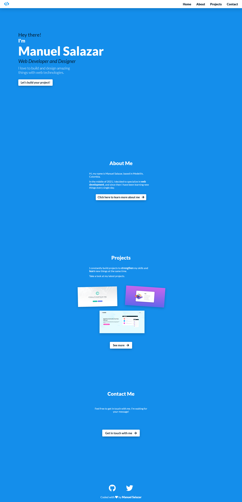
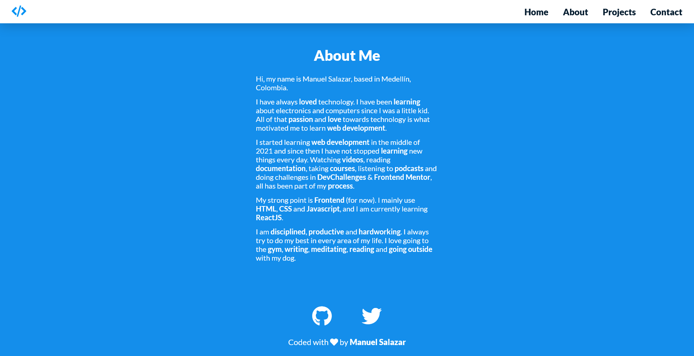
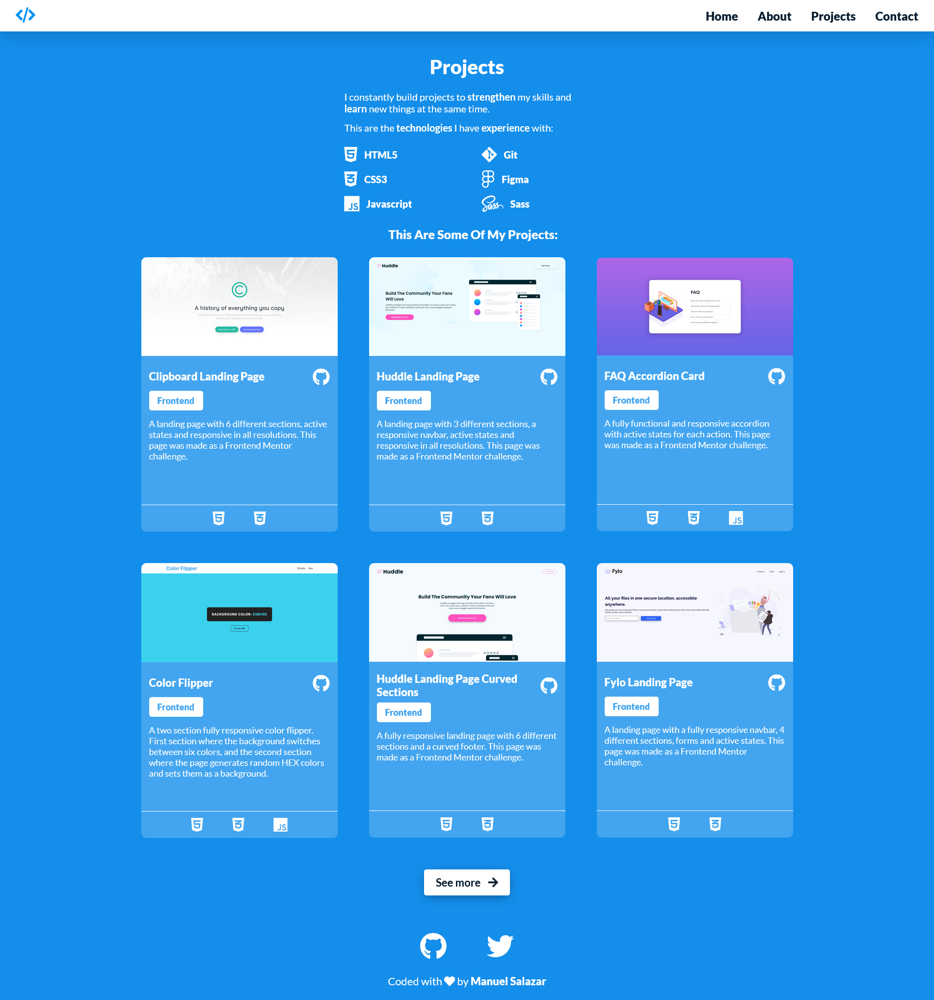
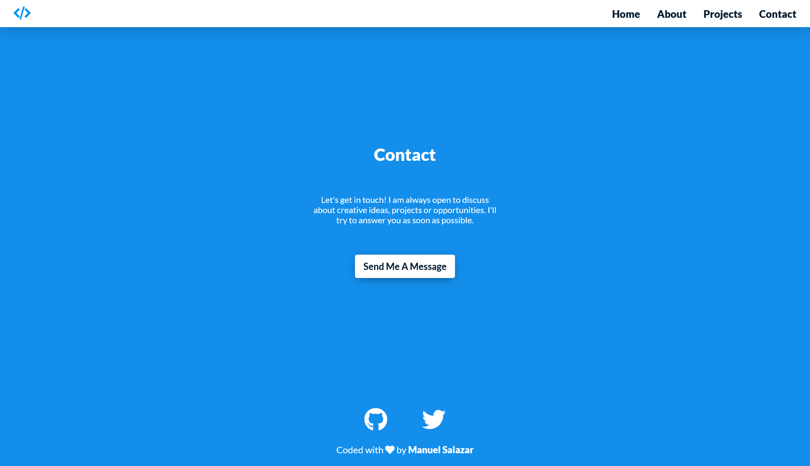

# Personal Portfolio Page
My most ambicious project yet, my personal portfolio page. This project has four different pages: home page, about me page, projects page and contact me page. The project is completely responsive in all resolutions and was developed mobile first. It also has a responsive navbar made with pure Javascript. From this project, a potential client can know everything he needs to know about me and can see my main projects.

- [Page](https://manuelsalazardev.netlify.app) - Final result of the project
- [Design](https://www.figma.com/file/MFYM4Azp9zzZnthjpRNPcB/Personal-Portfolio-Page?node-id=437%3A2) - Design of the page made in Figma

## Final Results:
Home Page

About Me Page

Projects Page

Contact Me Page

## Built with:
- [HTML5](https://developer.mozilla.org/en/docs/Web/HTML)
- [CSS3](https://developer.mozilla.org/en/docs/Web/CSS)
- [Javascript](https://developer.mozilla.org/en/docs/Web/JavaScript)
- [Figma](https://www.figma.com/)
- [Netlify](https://www.netlify.com)
